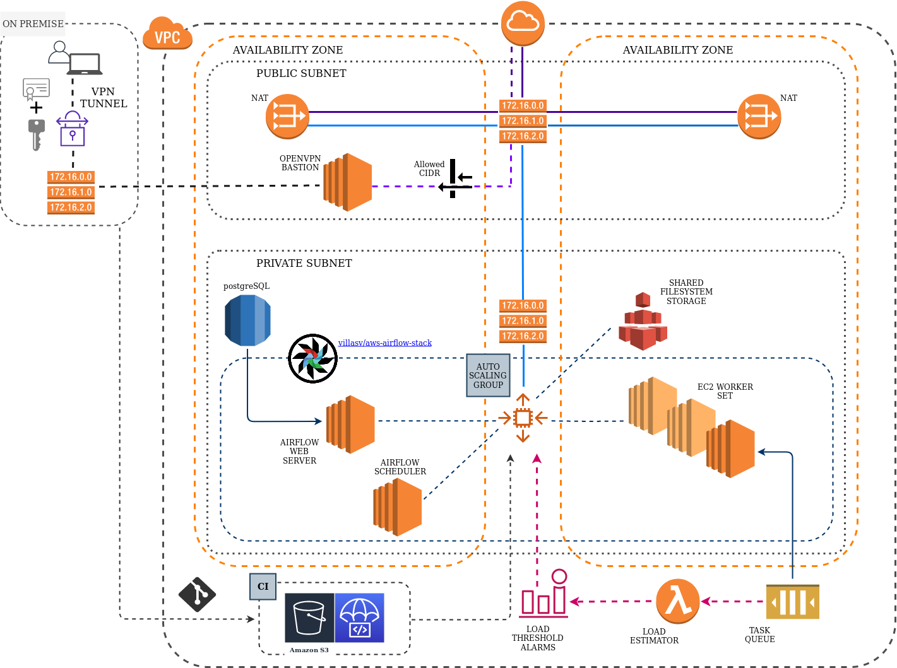

# AWS Airflow Build

This project is currently WIP. It is a fully functional Airflow Build using Cloudformation and EC2 instances.

**Goal:**
This airflow project is enabling both interaction with a local minikube environment for testing and development 
and with a custom Kubernetes production environment EKS on AWS. 

The demo DAG intends to bid for spot instances and is scaling an external ECS cluster accordingly.

---




## Project Design

The Airflow AWS deployment is based on [https://github.com/villasv/aws-airflow-stack](https://github.com/villasv/aws-airflow-stack). 
In addition there is a VPN Bastion Host implemented, which strictly allows ingress from internal network IPs only. 
Also the Airflow webserver endpoint can only be reached with the VPN activated.

In a future version all Airflow EC2 services will be replaced by an EKS deployment.

### 1. Deploy

Using [AWS CodeDeploy](https://docs.aws.amazon.com/codedeploy/latest/userguide/getting-started-codedeploy.html).

- See [https://github.com/villasv/aws-airflow-stack](https://github.com/villasv/aws-airflow-stack) for more details on the implementation.


### 2. Airflow Stuff

- verify and confirm that function is **idempotent**

- understand the [airflow scheduler](https://cwiki.apache.org/confluence/display/AIRFLOW/Scheduler+Basics). 

- adjust airflow scheduler datetime to the current tz (or utc)

- store passwords as encrypted  

- store all variables in a [single json variable](https://medium.com/datareply/airflow-lesser-known-tips-tricks-and-best-practises-cf4d4a90f8f). 

- Do not load dags with prefix `archive_`

---


#### Local Docker-Compose Build

**NOTE:** Currently NOT implemented - TODO: Integrate local CodeDeploy setup with docker-compose environment for local testing and development.

```
# default AIRFLOW_HOME = /usr/local/airflow
# plugins_folder = /usr/local/airflow/plugins
# dags_folder = /usr/local/airflow/dags
# More information see 'airflow.cfg'

$ docker-compose -f docker-compose.testing.yml up --build

$ docker-compose -f docker-compose.testing.yml exec webserver sh -c "airflow list_dags"

# Run a task without scheduling, find date time in **Graph View**
# NOTE: Take task_id always from OperatorInstance
$ docker-compose -f docker-compose.testing.yml exec webserver sh -c "airflow test prosp_operator_dag prosp_operator_task 2018-05-08T09:55:57.966423+00:00"

# NOTE: Always ensure that a [new http Connection](#### Managing Connections) is created in Admin > Connections 
$ docker-compose -f docker-compose.testing.yml exec webserver sh -c "airflow test demo_gcc_llife_prod_report_DAG prosp_save_file_to_gcs_operator 2018-05-08T09:55:57.966423+00:00"

$ docker-compose -f docker-compose.testing.yml exec webserver sh -c "airflow test llife_prod_report_dag wait_for_prod_report 2018-05-08T09:55:57.966423+00:00"

# Schedule all available dags
$ docker-compose -f docker-compose.testing.yml exec webserver sh -c "airflow scheduler"

$ docker-compose -f docker-compose.testing.yml exec webserver sh -c "airflow upgradedb"

# FlaskWorker
$ docker-compose -f docker-compose.testing.yml exec webserver sh -c "airflow connections --add --conn_id local_webapi_docker --conn_type http --conn_host webapi --conn_port 5000"


```

  

## Getting Started. 


---

**NOTE: This is still all preliminary for the current version! In this Master Version, the local development** 
**environment is NOT established yet.**.

PRODUCTION WORKS AS DESCRIBED.

---

### 1. Preparing the Environment. 
  


#### Prerequisites

- [Optionally] Pyenv
- Pipenv integrated with Pyenv
- Python Version 3.6.8
- Docker installed

#### Install

Pyenv and Pipenv is the new way to go for Python version control and virtual environments. Visit [SecretOfPythonPath](https://github.com/olmax99/secretofpythonpath) project for how to get started.  

Docker should be installed on the system, else please read the official Docker docs.

##### Step 1: Set the Python Version

```
# In directory airflowapp
$ ls -al   # you should have a local file .python-version in the top of project directory

# Optionally
$ pyenv local 3.7.4
$ python -V         # Python 3.7.4


```

##### Step 2: Create a new Pipenv.lock file if not present in the composer directory

```
# Will create the virtual environment folders along with a Pipfile.lock
$ cd composer && pipenv install


```

##### Postgres Database can only be accessed locally

Find Postgres Admin at `localhost:8000`

```
PGADMIN_DEFAULT_EMAIL: pgadmin4@pgadmin.org
PGADMIN_DEFAULT_PASSWORD: pgadmin


```


##### Step 4: Docker deamon

**NOTE:** The Docker needs to be configured in order to be a [target to Prometheus](https://docs.docker.com/config/thirdparty/prometheus/).

**Linux:**

Create file is it does not exist. In `/etc/docker/daemon.json`:

```
{
  "metrics-addr" : "127.0.0.1:9323",
  "experimental" : true
}


```

## Run in development mode

```
$ docker-compose -f docker-compose.development.yml up --build

```

#### Explanation for using FUSE:

In the current development setup, it is required that all files written to `mnt/efs`, which is the
default path for the shared filesystem storage for all cluster nodes.


**TODO:** This is achieved by the following file system mappings:

1. The directory `airflowapp/data` inside docker is a volume mapped to `airflowapp/local_data`.
2. The directory `airflowapp/local_data` is directly mounted to the EFS shared filesystem.


### 1. Adding local Connections for development and testing

STEP 1: Add connection programmatically

- In `airflowapp/create_connections.py` add the code according to previous examples provided 

STEP 2: Add passwords and logins to environment variables

- In `.dev.override.env` add the appropriate environment variable, I.e.

```
MY_CUSTOM_LOGIN=username
MY_CUSTOM_PASSWORD=super_secret

``` 

STEP 3: Adjust Dockerfile

All custom variables need to be added in the section `# Custom passwords (i.e. connections)`.

```
# NOTE: ARGs are mandatory for Dockerfile environment variable initialization!!
ARG MY_CUSTOM_LOGIN
ARG MY_CUSTOM_PASSWORD

ENV MY_CUSTOM_LOGIN=$MY_CUSTOM_LOGIN
ENV MY_CUSTOM_PASSWORD=$MY_CUSTOM_PASSWORD

```

From then on, all variables can be used in `create_connections.py`.


### 2. Sync local 'gcsfuse/data' directory with EFS

**RexRay**: [https://rexray.readthedocs.io/en/stable/user-guide/storage-providers/aws/#aws-efs](https://rexray.readthedocs.io/en/stable/user-guide/storage-providers/aws/#aws-efs)


## Run in production

The production environment is the AWS EC2 ScalingGroup environment. Interact with all the   
respective resources via the AWS API or the AWS Console.

#### 1. Add all custom connections

1. To be added

```
...


```

#### 2. Create new  Production Environment

**STEP 1:** Create the CloudFormation environment.

```
$ make cluster
	
```

**STEP 2:** Deploy the Airflow application

In `airflowapp`:
```
$ export stack_name=<your stack>

$ make deploy

```

#### 3. Connect to Airflow Webserver

- **Linux**:

Activate VPN:
```
# Ensure that Vpn connection is active through nmcli or networks settings
$ make vpn

```

In Browser: http://<internal webserver ip>:8080


## Running the Tests. 


### FAQ


## Author

OlafMarangone
Contact [olmighty99@gmail.com](mailto:olmighty99@gmail.com) 


## FAQ's

- How is a simple airflow project being build with docker?

  * [https://github.com/puckel/docker-airflow](https://github.com/puckel/docker-airflow)

- Can an airflow task (from within docker) trigger another docker to do something?

  * YES! Within tasks there are operators, which handle the execution of them. There is a
Specific **DockerOperator** for this:

  * [https://github.com/apache/airflow/docker_operator.py](https://github.com/apache/airflow/blob/master/airflow/operators/docker_operator.py)

- Where can I find the DAG directory and how to define them?

  * It is defined in `airflow.cfg`: dags_folder = /usr/local/airflow/dags

- Is it possible to let tasks communicate between each other?

  * Yes, the feature is called **XCom**.

- What is the difference between LocalExecutor, SequentialExecutor, and CeleryExecutor?

  * The LocalExecutor can parallelize task instances locally, but only works in a simple single-container-like environment (even though there is an option of connecting custom data bases, i.e. replacing sqlite with postgreSQL.

- How to set up Postgres usage instead of local sqlite?

  * To configure Airflow to use Postgres rather than the default Sqlite3, go to airflow.cfg and update this configuration to `LocalExecutor`

Airflow.cfg

```
# The executor class that airflow should use. Choices include
# SequentialExecutor, LocalExecutor, CeleryExecutor
executor = LocalExecutor


```

- How can single tasks from a dag file be tested without actually running? 


- How to run execute each operator run on a different cluster node?


- Where can the output log from an executed task be reviewed in the GUI?

  * In DAG overview go to the respective DAG > select Graph View > select the task to review the log for > View Log

- What is the context inside an Operator's `execute(self, context)` function?

  * The context of a task may look like this:  


```
{'dag': <DAG: prosp_operator_dag>,
 'ds': '2018-05-08',
 'next_ds': '2018-05-08',
 'prev_ds': '2018-05-07',
 'ds_nodash': '20180508',
 'ts': '2018-05-08T09:55:57.966423+00:00',
 'ts_nodash': '20180508T095557.966423+0000',
 'yesterday_ds': '2018-05-07',
 'yesterday_ds_nodash': '20180507',
 'tomorrow_ds': '2018-05-09',
 'tomorrow_ds_nodash': '20180509',
 'END_DATE': '2018-05-08',
 'end_date': '2018-05-08',
 'dag_run': None,
 'run_id': None,
 'execution_date': <Pendulum [2018-05-08T09:55:57.966423+00:00]>,
 'prev_execution_date': datetime.datetime(2018, 5, 7, 12, 0, tzinfo=<TimezoneInfo [UTC, GMT, +00:00:00, STD]>),
 'next_execution_date': datetime.datetime(2018, 5, 8, 12, 0, tzinfo=<TimezoneInfo [UTC, GMT, +00:00:00, STD]>),
 'latest_date': '2018-05-08',
 'macros': <module 'airflow.macros' from '/usr/local/lib/python3.6/site-packages/airflow/macros/__init__.py'>,
 'params': {},
 'tables': None,
 'task': <Task(ProspOperator): prosp_operator_task>,
 'task_instance': <TaskInstance: prosp_operator_dag.prosp_operator_task 2018-05-08T09:55:57.966423+00:00 [None]>,
 'ti': <TaskInstance: prosp_operator_dag.prosp_operator_task 2018-05-08T09:55:57.966423+00:00 [None]>,
 'task_instance_key_str': 'prosp_operator_dag__prosp_operator_task__20180508',
 'conf': <module 'airflow.configuration' from '/usr/local/lib/python3.6/site-packages/airflow/configuration.py'>,
 'test_mode': True,
 'var': {'value': None, 'json': None},
 'inlets': [],
 'outlets': []}


```


